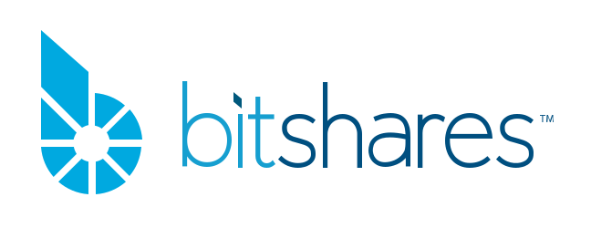

# Awesome BitShares Blockchain  

> A curated list of awesome BitShares resources for users and developers.

 The BitShares Blockchain is an industrial-grade decentralized platform
 built for high-performance financial smart contracts. It represents the
 first decentralized autonomous community that lets its core token
 holder decide on its future direction and products.
 In contrast to other smart contracting platform, its strict focus on
 security and reliabilty has allowed the BitShares Blockchain to become the
 largest host of decentralized exchanges.

Contributions welcome. Add links through pull requests or create an issue to start a discussion.

## Contents

- [Awesome BitShares Blockchain](#awesome-bitshares-blockchain)
  - [Websites](#websites)
  - [Documentation](#documentation)
  - [Community](#community)
  - [News](#news)
  - [Conferences](#conferences)
- [Utilities](#utilities)
  - [Downloads](#downloads)
  - [Blockchain API](#blockchain-api)
  - [Extended APIs](#extended-apis)
  - [Kibana and ElasticSearch Endpoints](#kibana-and-elasticsearch-endpoints)
  - [Opensource Wallets](#opensource-wallets)
  - [Hosted Wallets](#hosted-wallets)
  - [Blockchain Explorers](#blockchain-explorers)
- [Libraries](#libraries)
  - [C++ Libraries](#c-libraries)
  - [Go Libraries](#go-libraries)
  - [Java Libraries](#java-libraries)
  - [JavaScript Libraries](#javascript-libraries)
  - [Python Libraries](#python-libraries)
  - [Tools and Scripts](#tools-and-scripts)
- [Projects Using the BitShares Blockchain](#projects-using-the-bitshares-blockchain)
   - [Exchanges](#exchanges)
   - [Bridges](#bridges)
   - [Games](#games)
   - [NFT](#nft)
   - [Services](#services)
- [Other Blockchains in the BitShares Family](#other-blockchains-in-the-bitshares-family)

## Awesome BitShares Blockchain

A curated list of resources around the BitShares Blockchain and its
ecosystem.

Want to contribute to the list? Read the [contributors guide](CONTRIBUTING.md)!

### Websites

* [BitShares.org](https://bitshares.org) - The main website
* [BitShares.build](https://bitshares.build) - Another site maintained by the community
* [BitSharesManagement.Group](https://bitsharesmanagement.group) - Main site of BitShares Management Group (BTSMG)

### Documentation

* [How.BitShares.works](https://how.bitshares.works) / [docs.bitshares.org](https://docs.bitshares.org) - The primary documentation, maintained by the community, hosted by github.
* [Dev.BitShares.works Docs](https://dev.bitshares.works) - The BitShares Developers Portal.
* [BitShares-Core Wiki](https://github.com/bitshares/bitshares-core/wiki) - Documentation about the core software development and integration. 
* [BitShares-Core Doxygen Documentation](https://doxygen.bitshares.org) - Documentation generated from BitShares-Core code base.
* [BitShares-UI Wiki](https://github.com/bitshares/bitshares-ui/wiki) - Guidelines about how to integrate or contribute to the reference wallet project.
* [BitShares-UI Help](https://wallet.bitshares.org/#/help) - Guidelines about how to use the reference wallet software.
* [BitShares Build Docs](https://docs.bitshares.build) - Light prompt help pages
* [docs.bitshares.eu](https://docs.bitshares.eu) - The original, worker funded documentation site. Now redirects to [how.bitshares.works](https://how.bitshares.works). The old documentation is [here](https://github.com/bitshares/docs.bitshares.org).
* [中文文档](https://github.com/abitmore/bts-cn-docs) - Documentation in Chinese, maintained by the Chinese community.

### Community

* [BitSharesTalk Forum](https://bitsharestalk.org) - The original board of discussion for BitShares (ever since 2013).
* [Hive#bitshares](https://hive.blog/created/bitshares) - #bitshares tagged posts on the Hive blockchain.
* [Steem#bitshares](https://steempeak.com/created/bitshares) - #bitshares tagged posts on the Steem blockchain.
* [Whaleshares#bitshares](https://whaleshares.io/created/bitshares) - #bitshares tagged posts on the WHALESHARES blockchain.
* [Twitter@bitsharesorg](https://twitter.com/bitsharesorg) - Content managed by bitshares.org owner.
* [Twitter@BitSharesGroup](https://twitter.com/bitsharesgroup) - Content managed by BitSharesGroup.org owner.
* [Twitter#BitShares](https://twitter.com/search?q=%23BitShares) - #BitShares tagged on Twitter.
* [Twitter#bitshares](https://twitter.com/search?q=%23bitshares) - #bitshares tagged on Twitter.
* [Reddit#bitshares](https://reddit.com/r/bitshares) - Reddit sub-reddit for BitShares.
* Telegram:
  * [BitShares DAC](https://t.me/BitSharesDAC) - General discussions.
  * [BitShares Group](https://t.me/BitSharesGroup) - Another group for general discussions.
  * [BitShares Mobile](https://t.me/btsplusplus) - Focus on BitShares mobile app.
  * [BitShares Development](https://t.me/BitSharesDEV) - For developers.
  * [BitShares Node Admins](https://t.me/BTS_Node_Admins) - Provides server admins & interested parties with tech support.
  * [BitShares NFTs](https://t.me/BitSharesNFTs) - NFT (Non-fungible tokens) discussions.
  * [BitShares Traders](https://t.me/Bitshares_Traders) - Focus on Trading.
  * [BitShares Wallet Help](https://t.me/btsWalletHelp) - Web-based wallet & desktop wallet support.
  * [PyBitShares](https://t.me/pybitshares) - Focus on python-bitshares development.
  * [BeetApp](https://t.me/beetapp) - Focus on beetapp development.
  * [DEXBot](https://t.me/DEXBOTbts) - Focus on DEXBot development.
  * Committee - (invite only) For committee members.
  * Witnesses - (invite only) For block producers.
* [Discord - BitShares](https://discord.gg/6V2RdsJXX3)

### News

* [News.BitShares.org](https://news.bitshares.org/)

### Conferences

* [Decentralized 2019 - BitShares as Event Partner](https://decentralized.com) - In Athens, Greece.
* [Bitfest 2018](https://hive.blog/@bitfest) - in Amsterdam, Netherlands.
* [Graphene DevCon 2018](https://hive.blog/graphene/@jademont/global-graphene-blockchain-devcon-is-successfully-concluded) - in Shanghai, China.

## Utilities

### Downloads

* [BitShares-Core](https://github.com/bitshares/bitshares-core/releases) - full node and command line tools
* [BitShares-UI](https://github.com/bitshares/bitshares-ui/releases) - desktop light wallet
* [BitShares Mobile App](https://app.btspp.io/) - iOS and Android
* [Media Kit](https://github.com/bitshares/marketing/tree/master/media-kit) - Logos, banners and etc

### Blockchain API

Given that many businesses and community members operate their own API
endpoints, duplicating that list here would be unecessary efforts. Hence,
we here link to the list of nodes as used in the reference wallet on
wallet.bitshares.org.

* [List of Blockchain API endpoints](https://github.com/bitshares/bitshares-ui/blob/develop/app/api/apiConfig.js#L128)

### Extended APIs

There are some extended APIs provided by the community.

* https://api.bitshares.ws/docs
* https://api.bitshares.build/api-docs
* https://cryptofresh.com/api/docs
* https://xbts.io/cmc-api
* https://api.testnet.bitshares.ws/docs - for the public testnet

### Kibana and ElasticSearch Endpoints

Kibana and ElasticSearch endpoints can be used to query blockchain data and perform visualizations.

* kibana.bitshares.eu Down for maintenance.
* [kibana.bts.mobi](https://kibana.bts.mobi) (and [es.bts.mobi](https://es.bts.mobi/bitshares-*/data/_count?pretty=true) for raw data).

### Opensource Wallets

* [BTS++](https://btspp.io) - native Android/iOS app.
* [BiTSy](http://www.BiTSy-wallet.com) - native Android wallet with Merchants/Tellers map, in 104 languages.
* [Beet](https://github.com/bitshares/beet) - standalone web application.
* [BitShares-UI (Reference Wallet)](https://github.com/bitshares/bitshares-ui) - reference web wallet (ReactJS).
* [Community UI](https://github.com/bitshares/bitshares-community-ui) - fully responsive community web wallet (VueJS).
* [Citadel Desktop Wallet](https://github.com/jhtitor/citadel) - desktop wallet written in Python
* [EVRAZ Wallet](https://github.com/evraz-org/EVRAZ-smartphone-application) - Android app
* [Ledger App](https://github.com/bitshares/ledger-app-bitshares) - Bitshares Wallet App for Ledger Nano S

### Hosted Wallets

**Warning**: Since these are hosted wallets, they may have access to your
private account credentials and thus, your funds may be at risk. Do your own
research!

#### Hosted Mainnet Wallets

* [wallet.bitshares.org](https://wallet.bitshares.org) - BitShares.org hosted reference wallet, lastest release.
* [staging.bitshares.org](https://staging.bitshares.org) - BitShares.org hosted reference wallet, latest release candidate.
* [develop.bitshares.org](https://develop.bitshares.org) - BitShares.org hosted reference wallet, latest in-development version.
* [bts.exchange](https://bts.exchange) - BitSharesGroup.org hosted reference wallet.
* [m.magicw.net](https://m.magicw.net) - Web version of the MagicWallet Android/iOS app.
* [app.xbts.io](https://app.xbts.io) - New DeFi wallet with AMM liquidity pools
* Check the [Exchanges](#exchanges) running on the BitShares blockchain too.

#### Hosted Testnet Wallets

* [test.xbts.io](https://test.xbts.io)
* testnet.bitshares.org - down for maintenance.

### Blockchain Explorers

* [BTS.ai](https://bts.ai) - closed source.
* [cryptofresh.com](https://cryptofresh.com) - closed source, operational since 2015.
* [blocksights.info](https://blocksights.info) - supports both Mainnet and the public testnet. Closed source, an improved version of the open-source [open-explorer](https://github.com/bitshares/open-explorer).

## Libraries

Libraries capable of communicating with the BitShares blockchain.

### C++ Libraries

* [bitshares-core](https://github.com/bitshares/bitshares-core) - reference code base that operates the blockchain.

### Go Libraries

* [bitshares-go](https://github.com/scorum/bitshares-go) - BitShares golang client
* [go-bitshares](https://github.com/denkhaus/go-bitshares) - API for BitShares - supports websocket RPC & Wallet functions

### Java Libraries

* [graphenej](https://git.agorise.net/agorise/graphenej) - Graphene Java lib for mobile app Developers.

### JavaScript Libraries

* [bitsharesjs](https://github.com/bitshares/bitsharesjs) - used by reference wallet.
* [btsdex](https://github.com/scientistnik/btsdex) - alternative javascript library.
* [vuex-bitshares](https://github.com/TrustyFund/vuex-bitshares) - used by Trusty/Community UI.

### Python Libraries

* [python-bitshares](https://github.com/bitshares/python-bitshares) - full featured python library.
* [bitshares-p2p](https://github.com/HarukaMa/bitshares-p2p) - Pocking around p2p protocol of BitShares network.
* [BitShares Explorer REST API](https://github.com/bitshares/bitshares-explorer-api) - API for the open-source [open-explorer](https://github.com/bitshares/open-explorer)
* [BitShares HUG REST API](https://github.com/BTS-CM/Bitshares-HUG-REST-API) - A HUG REST API for the BitShares network

### PHP Libraries

* [bitshares-php](https://github.com/Codaone/bitshares-php) - A php library, for reading bitshares blockchain

### Tools and Scripts

* [DEXBot](https://github.com/Codaone/DEXBot) - Market Maker bot
* [extinction-event](https://github.com/litepresence/extinction-event) - bitsharesQUANT Distributed Exchange Algo Trading Framework
* [bitshares-scripts](https://github.com/bitfag/bitshares-scripts) - a set of python scripts.
* [bitshares-tradehistory-analyzer](https://github.com/bitfag/bitshares-tradehistory-analyzer) - a set of scripts for exporting and analyzing trading history.
* [StakeMachine](https://github.com/xeroc/stakemachine) - Trading Bot Infrastructure for the BitShares Decentralized Exchange (DEX).
* [Uptick](http://docs.uptick.rocks) - command line tool.
* [Telegram notifier](https://github.com/Codaone/BitShares-Telegram-notifier) - a simple bitshares telegram notifier
* [bts-notifier](https://github.com/scientistnik/bts-notifier) - Telegram bot for sending BitShares account notifications
* [PoolTool](https://github.com/iamredbar/PoolTool) - A simple GUI tool to help anyone use Liquidity Pools on the BitShares blockchain.

## Projects Using the BitShares Blockchain

**Warning**: Being listed here is **not endorsement** nor does it provide any
credibility to these projects. Even though the authors of this list have high
quality standards, limited resources prevent them from keeping this list
up-to-date with respect to their credibility. Use this list at your own risk and
do your own research!

### Exchanges

* Citadel `https``://citadel.li` outdated
* [DelionDEX](https://dex.delion.online)
* [EVRAZ](https://evrazdex.org)
* [GDEX](https://www.52bts.net)
* [ioBanker](https://iobanker.com)
* [XBTS](https://xbts.io)
* [AEX](https://www.aex.com/) - A centralized exchange with its exchange token (GAT) and stable coins (CNC) on BitShares

### Bridges

* [BlockTrades](https://blocktrades.us)
* [Exolix](https://exolix.com)
* [GoDex](https://godex.io)
* [SimpleSwap](https://simpleswap.io)
* [StealthEx](https://stealthex.io)
* [SwapSpace](https://swapspace.co)
* [ioxbank](https://ioxbank.com)

### Games

* [SmartHoldem](https://dexgames.net) 

### NFT

* [ArtCASA Gallery](https://artcasa.gallery) 
* [NFTEA Gallery](https://nftea.gallery) 

### Services

* [Apptrade](https://www.apptrade.io) - A profit sharing marketplace, described as “the stock market for apps”, that runs on the BitShares blockchain.
* [Compumatrix](https://compumatrix.com) - Business process outsourcing and home-based employment.
* [EVRAZ](https://www.evrazcoin.org) - Global System of Electronic Payments on BitShares
* [Lykke](https://www.lykke.com)
* [PalmPay](https://PalmPay.io) - A chain-agnostic Point Of Sale system, using Bitshares DEx, in 104 languages.
* [Quintric](https://quintric.com)
* [Moneda Par](https://monedapar.com.ar) - A non-profit based in Argentina that allows the exchange of goods and services through mutual loans.

## Other Blockchains in the BitShares Family

BitShares being the first that is build on the Graphene or graphene-like base
system, other blockchains have been deployed that make use of the very same
foundations:

* [Crypviser](https://crypviser.network)
* [Cybex](https://dex.cybex.io)
* [EOS](https://eos.io)
* [Hive](https://hive.io)
* [Peerplays](https://www.peerplays.com)
* SOUNDAC (PeerTracks) `https``://soundac.io` - currently in maintenance, moving to other tech
* [Scorum](https://scorumcoins.com/en-us)
* [Serey](https://serey.io)
* [Smoke Network](https://smoke.network)
* [Steem](https://steempeak.com)
* [TUSC](https://tusc.network) - The Universal Settlement Coin
* [VIT](https://vicetoken.com)
* [Whaleshares](https://whaleshares.io)
* [Yoyow](https://yoyow.org/index_en.html)

# License

To the extent possible under law, [Dr.-Ing. Fabian
Schuh](https://github.com/xeroc) has waived all copyright and related or
neighboring rights to this work.
